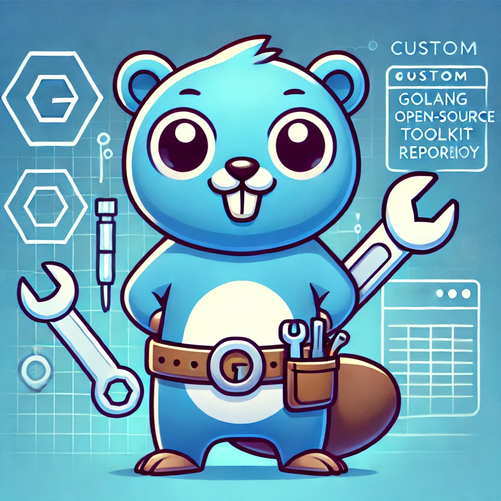

[](http://commitizen.github.io/cz-cli/)
[](https://github.com/lcnascimento/go-kit/actions/workflows/release.yaml)

<p align="center">
    
</p>
<p align="center"><h1 align="center">GO-KIT</h1></p>
<p align="center">
	<em>Go Kit is a repository of utilitary packages written in Go.</em>
</p>
<p align="center">
</p>
<p align="center"><!-- default option, no dependency badges. -->
</p>
<p align="center">
	<!-- default option, no dependency badges. -->
</p>
<br>

## 🔗 Table of Contents

- [🚀 Getting Started](#-getting-started)
  - [☑️ Prerequisites](#-prerequisites)
  - [🤖 Usage](#🤖-usage)
  - [🧪 Testing](#🧪-testing)
- [📌 Project Roadmap](#-project-roadmap)
- [🔰 Contributing](#-contributing)

---

## 🚀 Getting Started

### ☑️ Prerequisites

Before getting started with go-kit, ensure your runtime environment meets the following requirements:

- **Programming Language:** Go
- **Package Manager:** Npm, Go modules
- **Container Runtime:** Docker

### 🤖 Usage

Use any go-kit package in your project following the command:

```sh
❯ go get github.com/lcnascimento/go-kit/<desired packaged>
```

### 🧪 Testing

Run the test suite using the following command:

```sh
❯ make test.unit
```

---

## 📌 Project Roadmap

- [x] **`env`**
- [x] **`errors`**
- [x] **`o11y`**
- [x] **`validator`**
- [x] **`httpclient`**
- [x] **`grpcserver`**
- [x] **`messaging`**
- [ ] **`featureflag`**

---

## 🔰 Contributing

- **💬 [Join the Discussions](https://github.com/lcnascimento/go-kit/discussions)**: Share your insights, provide feedback, or ask questions.
- **🐛 [Report Issues](https://github.com/lcnascimento/go-kit/issues)**: Submit bugs found or log feature requests for the `go-kit` project.
- **💡 [Submit Pull Requests](https://github.com/lcnascimento/go-kit/blob/main/CONTRIBUTING.md)**: Review open PRs, and submit your own PRs.

<details closed>
<summary>Contributing Guidelines</summary>

1. **Fork the Repository**: Start by forking the project repository to your github account.
2. **Clone Locally**: Clone the forked repository to your local machine using a git client.
   ```sh
   git clone https://github.com/lcnascimento/go-kit
   ```
3. **Create a New Branch**: Always work on a new branch, giving it a descriptive name.
   ```sh
   git checkout -b new-feature-x
   ```
4. **Make Your Changes**: Develop and test your changes locally.
5. **Commit Your Changes**: Commit with a clear message describing your updates.
   ```sh
   git commit -m 'feat(package): Implemented new feature x.'
   ```
6. **Push to github**: Push the changes to your forked repository.
   ```sh
   git push origin feat/new-feature-x
   ```
7. **Submit a Pull Request**: Create a PR against the original project repository. Clearly describe the changes and their motivations.
8. **Review**: Once your PR is reviewed and approved, it will be merged into the main branch. Congratulations on your contribution!
</details>

---
